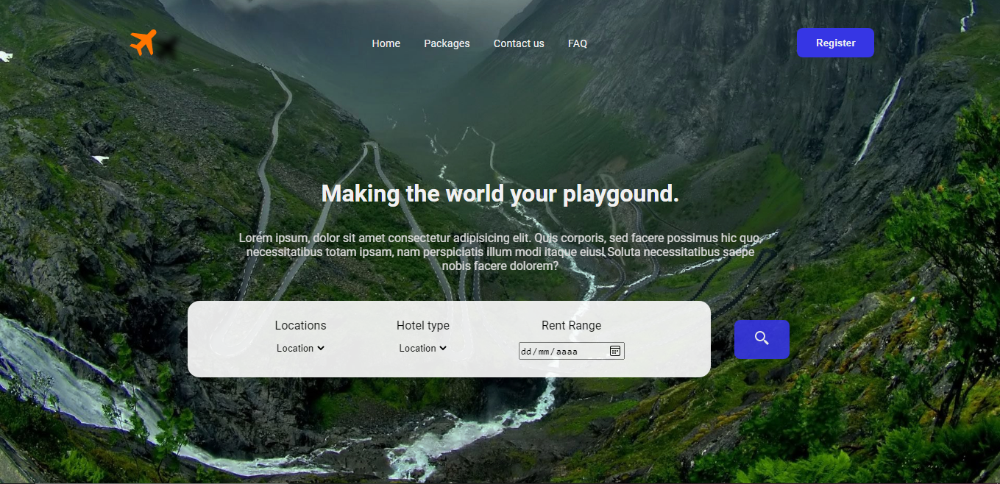
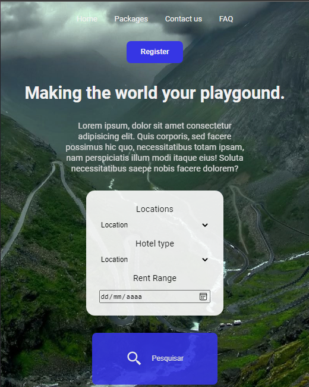

<h1 align="center">
  Rocket Travel
</h1>

  

 

<h1>Desktop</h1>

  

<h1>Mobile</h1>

  

## 🚀 Tecnologias

Esse projeto foi desenvolvido com as seguintes tecnologias:

- HTML
- CSS

## 🎨 Inspiração:

[Dribbble](https://dribbble.com/shots/17407084-Travel-Web-Header-Landing-Page-design/attachments/12533821?mode=media)
